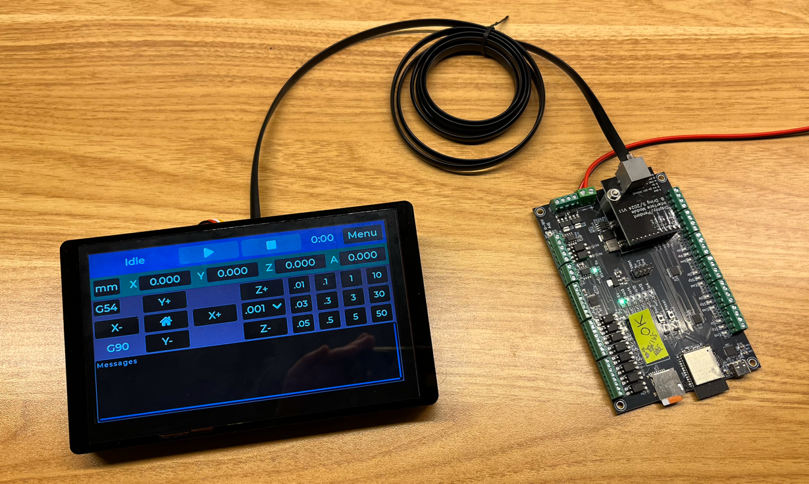

# FluidNC 7" Touch Display

## Overview
Touch display for FluidNC that enables you to operate your machine independently without being connected to a PC, Mac etc.

The display is based on the tablet plugin from the FluidNC WebUI and adapted to run on the 7" display from Elecrow.

 

## Features

 

## Parts
The display is designed to use the same interface boards as the pendant, they offer protection from EMC/EMI without compromising update speed of the display. This also means you need a controller board that has a module socket for pendant interfaces.

### Display & interface boards
**Display:** Elecrow 7" touch display with a builtin ESP32, Crowpanel 7.0". You can get this with or without an acrylic case depending on your use case. See below for options regarding cases.

[Elecrow Crowpanel 7"](https://www.elecrow.com/esp32-display-7-inch-hmi-display-rgb-tft-lcd-touch-screen-support-lvgl.html)

**Interface boards:** Fluiddial display module and fluiddial wiring kit are sold separately, you need one of each and can purchase them from Elecrom together with the display. Wires needed to connect fluiddial module to display are included.

https://www.elecrow.com/fluiddial-rj12-wiring-kit.html
https://www.elecrow.com/fluidnc-rj12-pendant-display-module.html

**RJ12 Cable:** To connect the display to your FLuidNC controller using the two modules, you need a 6 pin cable with RJ12 connectors in both ends. Cable lengths up to 2 meters has been tested successfully, cable can most likely be longer, we have just not verified this yet. Cables can be sourced from multiple vendors, here an example from :

https://www.aliexpress.com/w/wholesale-rj12-cable-6p6c.html

### FluidNC controller boards
Your FluidNC controller board must have a module socket for pendant interfaces. Below are a few examples of boards with module socket. 

For a full list of boards pls. check -> [FluidNC Wiki - Existing hardware](http://wiki.fluidnc.com/en/hardware/existing_hardware)

https://www.elecrow.com/6x-cnc-controller-for-fluidnc.html
https://www.elecrow.com/4x-cnc-controller-integrated-esp32-and-tmc2209.html

### Case
A couple of options exists, if you bought the acrylic case together with the display from Elecrow, then this stand might be an option for you: 

[Thingiverse - Elecrow display Stand](https://www.thingiverse.com/thing:6859400)

Did you only buy the display and are looking for a full case then perhaps this design could an option for you: 

[Fusion 360 - Crow7 case](https://a360.co/4jIbk0T)

 

## Installation
**[Installation guide](doc/installation.md)**

## Usage
**[User guide](doc/usage.md)**

## Bonus tips

When you buy [interface modules and controllers via Elecrow](https://www.elecrow.com/store/BartDring), you are supporting the team developing FluidNC.

 
 
 

---

Updated: Feb. 2025

---

<!--

## Resources

(Thonny)[https://thonny.org/]

(MicroPython Font files)[https://github.com/uraich/lv_mpy_examples_v8/tree/main/assets/font]

(Elecrow MicroPython builds)[https://www.elecrow.com/wiki/image/9/9e/MicroPython_7inch.zip]

The A version in MicroPython_7inch/firmware/firmware-7.0-A.bin includes tft_config.py and gt911.py as frozen modules.  The B version in MicroPython_7inch/driver+firmware/firmware-7.0-B.bin omits those driver modules, in favor of the versions in that directory - so you can change the config if you want.

(Newer MicroPython build)[https://forum.elecrow.com/uploads/018/QSXRZ8J45Z5G.zip]

Install micropython.bin at 0x10000
partition-table.bin at 0x8000
bootloader.bin at 0

(Adafruit ESPTool)[https://adafruit-esptool.glitch.me]

-->